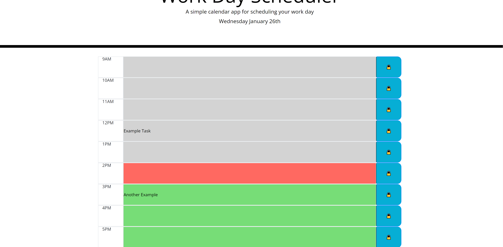

About the project: The goal of this project was to create a scheduler for the work day. At the top it displays the current date. Beneath that there is a grid for each hour between 9AM and 5PM. The user is able to click on each hour which opens a text area to type in something to schedule. When the save button is clicked the scheduled item will show up any time the page is loaded. Each text area has a background color depending if it is a past hour, the current hour, or a future hour.

Built using: HTML, CSS, Bootstrap, and Javascript

Usage: On page load the current date will  be displayed at the top. Each hour block will be automatically colored depending on the local time. The user will need to click on a text area, type in it, and then click on the save button to the right of that text area in order to save the text into local storage. Upon page reload the text will automatically still be there.

Images:
This image shows what the website looks when you load it. The current date is displayed at the top of the page, and the current hour is in red. 

This image demonstrates how the time changing has impacted the colors on the page. It also demonstrates that after page reload the saved task is displayed in the time block it was assigned to.

You can find the deployed website at:
https://nileshachmeister.github.io/week5homework/